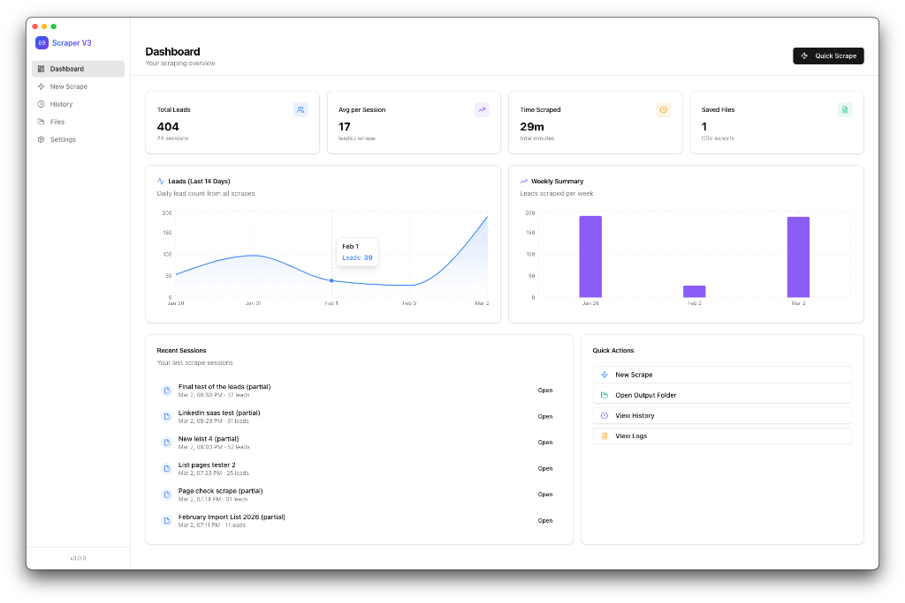
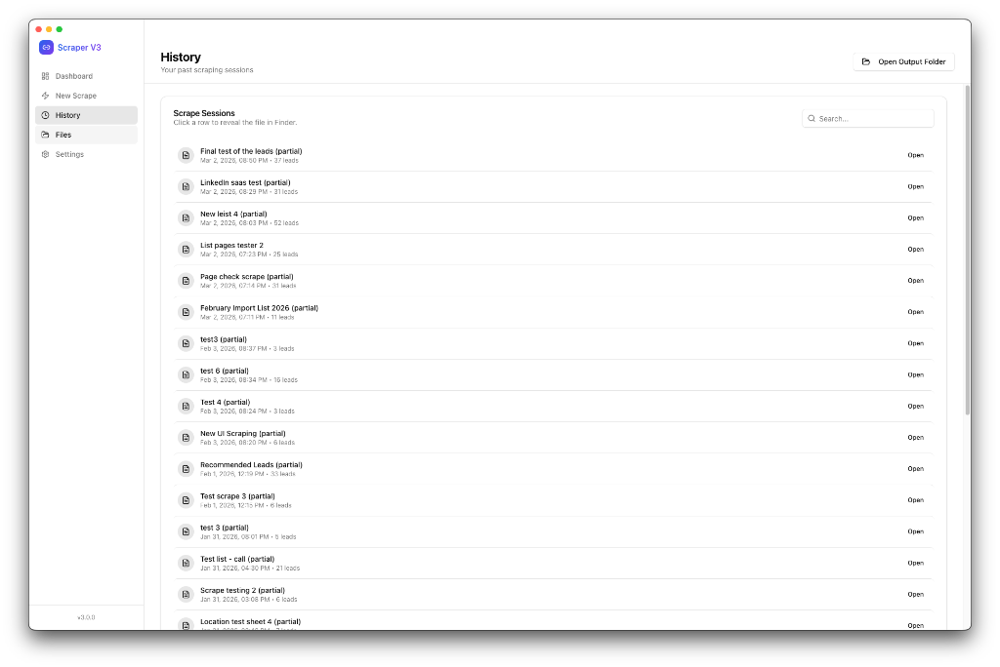
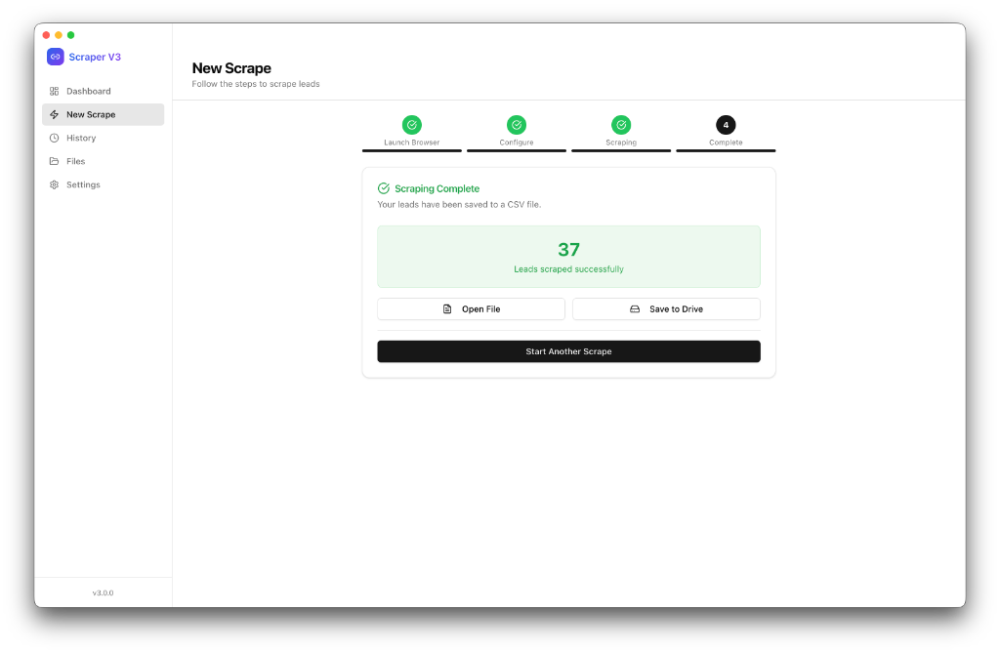
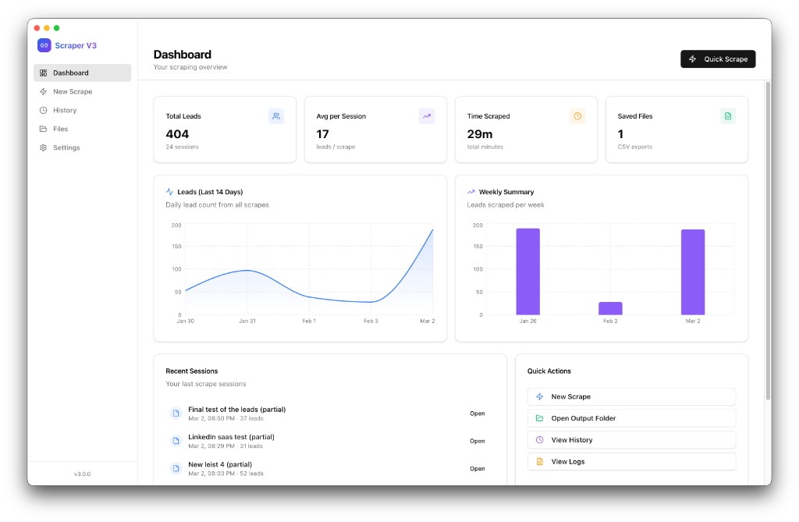

<div align="center">



# SalesNavExp — LinkedIn Sales Navigator Scraper

### A powerful macOS desktop app for extracting leads from LinkedIn Sales Navigator

[](https://github.com/srg-sphynx/SalesNavExp/releases)
[](https://github.com/srg-sphynx/SalesNavExp/releases)
[](https://electronjs.org)
[](https://github.com/srg-sphynx/SalesNavExp)

</div>

---

> [!WARNING]
> **⚠️ EXPERIMENTAL SOFTWARE — READ BEFORE USING**
>
> This is an **independent experiment** and a personal side project. It is:
> - **NOT affiliated with LinkedIn Corporation** in any way
> - **NOT notarized by Apple** (you may see a security warning on first launch)
> - **NOT endorsed, authorized, or supported** by LinkedIn or any of its partners
>
> Usage of this tool may violate [LinkedIn's User Agreement](https://www.linkedin.com/legal/user-agreement) and [Terms of Service](https://www.linkedin.com/legal/l/tos). You are solely responsible for how you use this tool.
>
> **Use at your own risk. Not recommended for misuse, commercial exploitation, or scraping at scale.**
>
> The author(s) accept no liability for any account suspension, data issues, or legal consequences arising from use of this software.

---

## ✨ Features at a Glance

<table>
<tr>
<td width="50%" valign="top">

### 🖥️ Native macOS Experience
- Vibrancy + blur effects — feels native on Mac
- Traffic light window controls
- System-aware dark/light mode
- titlebar hidden-inset style (no chrome border)
- Sidebar + main content layout familiar to macOS users

### ⚡ Smart Scraping Engine
- Connects to your **Chrome, Firefox, Brave, or Edge** browser via CDP (remote debugging)
- Scrapes LinkedIn Sales Navigator search result pages
- Extracts **Name + Profile URL** with high precision
- Human-like delays between leads (configurable 500ms–10s)
- Real-time progress with leads/min speed indicator
- **Stop & Save** at any point — partial results are never lost

</td>
<td width="50%" valign="top">

### 🌐 Multi-Browser Support *(V3.1)*
- Auto-detects installed browsers on your system
- Supports **Google Chrome**, **Firefox**, **Brave**, **Microsoft Edge**
- Each browser gets its own isolated profile for clean sessions
- One-click launch into LinkedIn Sales Navigator

### 📊 Analytics Dashboard
- Total leads scraped across all sessions
- Average leads per scrape session
- Total time invested in scraping
- 14-day daily lead trend chart (Recharts)
- Weekly bar chart summary
- Recent sessions quick-access list

</td>
</tr>
<tr>
<td width="50%" valign="top">

### 📁 File & History Management
- All scrapes saved as clean, properly-formatted **CSV** files
- Download folder organized under `LinkedIn Scraper/`
- Full scrape history with timestamps and lead counts
- Sessions grouped by **Today / Yesterday / date** *(V3.1)*
- **Clear History** with confirmation dialog *(V3.1)*
- **File-missing detection** — shows badge if CSV was moved/deleted *(V3.1)*
- One-click reveal in Finder

### ☁️ Google Drive Integration
- Direct upload to Google Drive after each scrape
- OAuth2 authentication with your Google account
- Requires `credentials.json` from Google Cloud Console

</td>
<td width="50%" valign="top">

### ⚙️ Configurable Settings
- Custom output directory (or default `~/Downloads/LinkedIn Scraper/`)
- Max leads per session (1–2000)
- Delay between leads (ms) — balance speed vs. safety
- CSV separator selection (comma / semicolon / tab)
- Timestamp in filename toggle
- Auto-open file in Finder after scrape
- Light / Dark / System theme

### ℹ️ About & Transparency *(V3.1)*
- About dialog shows: built by, AI model, system chip
- Dynamic chip detection (e.g., **Apple M4 Pro · 16 GB**)
- Version displayed in sidebar and about screen

</td>
</tr>
</table>

---

## 📸 Screenshots

<table>
<tr>
<td align="center" width="50%">
  
  <br/><sub><b>📊 Analytics Dashboard</b> — total leads, trend charts, quick actions</sub>
</td>
<td align="center" width="50%">
  
  <br/><sub><b>📋 History Page</b> — sessions grouped by date, search, reveal in Finder</sub>
</td>
</tr>
<tr>
<td align="center" width="50%">
  
  <br/><sub><b>✅ Scrape Complete</b> — leads count, open file, upload to Drive</sub>
</td>
<td align="center" width="50%">
  
  <br/><sub><b>⚡ New Scrape Flow</b> — step-by-step guided process</sub>
</td>
</tr>
</table>

---

## 🚀 Getting Started

### Requirements

| Requirement | Details |
|---|---|
| **macOS** | 12 Monterey or later (arm64 / Apple Silicon) |
| **LinkedIn Sales Navigator** | Active subscription required |
| **Browser** | Chrome, Firefox, Brave, or Edge installed |
| **Node.js** | v18+ (only if building from source) |

---

### Option A — Download the DMG (Recommended)

1. Go to [**Releases →**](https://github.com/srg-sphynx/SalesNavExp/releases)
2. Download `LinkedIn Scraper-3.1.0-arm64.dmg`
3. Open the DMG and drag the app to **Applications**

> **⚠️ "App is damaged" or "unidentified developer" warning?**
> This is expected — the app is **not notarized by Apple**. To bypass:

**Option 1 — Right-click to open:**
```
Right-click → Open → Open (in dialog)
```

**Option 2 — Remove quarantine via Terminal:**
```bash
xattr -cr "/Applications/LinkedIn Scraper.app"
```

**Option 3 — System Settings:**
```
System Settings → Privacy & Security → Allow apps from: Anywhere
```
(Then re-enable it after opening the app.)

---

### Option B — Build from Source

```bash
# 1. Clone the repo
git clone https://github.com/srg-sphynx/SalesNavExp.git
cd SalesNavExp

# 2. Install root dependencies (Electron + scraper)
npm install

# 3. Install and build the frontend
cd frontend
npm install
npm run build
cd ..

# 4. Start the app in dev mode
npm start

# 5. (Optional) Package as DMG
npm run build:dmg
```

---

## 🕹️ How to Use

### Step 1 — Launch a Browser

The app opens your browser in **remote debug mode** on port 9222. This lets the scraper connect to it without needing a browser extension.

1. Open the app → go to **New Scrape**
2. Select your preferred browser from the picker (Chrome, Firefox, Brave, Edge)
3. Click **Launch [Browser]**

> The browser will open to `linkedin.com/sales`

---

### Step 2 — Navigate to Your List

In the launched browser:
1. Log into LinkedIn Sales Navigator
2. Navigate to your **search results** or **saved list**
3. Ensure the results are visible on screen

---

### Step 3 — Configure & Start

Back in the app:
1. *(Optional)* Paste the Sales Navigator URL (or leave blank to scrape the current page)
2. Give your list a name (e.g., `"SaaS Founders Mar 2026"`)
3. Set max leads limit
4. Click **Start Scraping →**

The scraper will page through results automatically.

---

### Step 4 — Monitor Progress

While scraping:
- See live lead count and **leads/min** speed
- The sidebar shows **"Active Scrape"** with a pulsing green dot
- Navigate away freely — scraping continues in the background
- Click **Stop & Save** at any time to save partial results

---

### Step 5 — Access Your Results

When complete:
- Click **Open File** to reveal the CSV in Finder
- Click **Save to Drive** to upload directly to Google Drive
- View all past sessions in the **History** tab

---

## 📄 CSV Output Format

```csv
Name,LinkedIn Profile URL
Jane Smith,https://www.linkedin.com/in/janesmith
John Doe,https://www.linkedin.com/in/johndoe
```

Files are saved to `~/Downloads/LinkedIn Scraper/` by default with a timestamp in the filename:
```
SaaS_Founders_Mar_2026_2026-03-05T09-15-32.csv
```

---

## ☁️ Google Drive Setup (Optional)

To enable one-click Drive uploads:

1. Go to [Google Cloud Console](https://console.cloud.google.com/)
2. Create a new project
3. Enable the **Google Drive API**
4. Create **OAuth 2.0 credentials** for a "Desktop app"
5. Download the `credentials.json` file
6. Place the file in the app bundle:
   ```
   Right-click LinkedIn Scraper.app → Show Package Contents
   → Contents/ → paste credentials.json here
   ```
7. In the app, go to **Settings → Integrations → Connect Google Drive**
8. Complete the browser-based OAuth flow

---

## 🏗️ Technical Architecture

```
SalesNavExp/
├── main.js              # Electron main process — all IPC handlers, browser launch, file I/O
├── preload.js           # Context bridge — secure renderer ↔ main API
├── lib/
│   ├── scraper.js       # Playwright-based scraping engine (CDP connect)
│   └── googleDrive.js   # Google Drive OAuth2 + upload
├── frontend/            # React + Vite + Tailwind frontend
│   └── src/
│       ├── pages/
│       │   ├── Dashboard.jsx     # Stats + charts
│       │   ├── ScrapePage.jsx    # Browser picker + scrape flow
│       │   ├── HistoryPage.jsx   # Session history + clear
│       │   ├── FilesPage.jsx     # Recent CSV files
│       │   └── SettingsPage.jsx  # All settings + Drive
│       ├── components/
│       │   ├── Sidebar.jsx       # Nav with active scrape indicator
│       │   ├── AboutModal.jsx    # macOS-style About dialog
│       │   └── ui/               # shadcn/ui components
│       └── contexts/
│           └── ScrapeContext.jsx # Global scrape state
└── build/
    └── icon.png         # App icon
```

**Stack:**
| Layer | Technology |
|---|---|
| Shell | Electron 28 |
| Frontend | React 19 + Vite 7 |
| Styling | Tailwind CSS 3 + shadcn/ui |
| Charts | Recharts |
| Scraping | Playwright (CDP) |
| Cloud | Google Drive API v3 |
| Packaging | electron-builder |

---

## 🔧 Troubleshooting

| Problem | Solution |
|---|---|
| `"Chrome debug port not available"` | Click **Launch Browser** first, wait for it to fully open |
| `"No leads found on the page"` | Navigate to a Sales Navigator **search results** page |
| App says "File missing" in History | The CSV was moved or deleted from disk — history record remains |
| Browser doesn't appear in the picker | Browser is not installed at the standard macOS Applications path |
| Google Drive connection timeout | Re-check `credentials.json` placement and try reconnecting |
| `"App is damaged"` on launch | Run `xattr -cr "/Applications/LinkedIn Scraper.app"` in Terminal |

---

## ⚠️ Legal Disclaimer & Responsible Use

This tool is provided **for educational and experimental purposes only**.

- **Not affiliated with LinkedIn Corporation.** LinkedIn® is a registered trademark of LinkedIn Corporation.
- **Not notarized by Apple.** This app has not been submitted to or approved by Apple.
- **Use at your own risk.** Scraping LinkedIn may violate their [Terms of Service](https://www.linkedin.com/legal/user-agreement). Your account may be restricted or suspended.
- **Do not misuse.** This tool must not be used for spam, harassment, data resale, or any unlawful purpose.
- **No warranty.** This software is provided "as is" without any warranty. The author is not liable for any damages arising from its use.
- **Rate limiting.** Always use human-like delays. Aggressive scraping can trigger CAPTCHA, IP blocks, or account restrictions.

> By using this software you agree that you have read and understood these terms.

---

## 👤 Built By

**Reddy** — [@srg-sphynx](https://github.com/srg-sphynx)

Built with:
- **[Antigravity](https://github.com/)** — AI-assisted development platform
- **Claude Sonnet 4.5** — AI pair programmer
- **Electron + React** — the best combo for macOS desktop apps that don't feel like a website

---

## 📜 License

This project is released for **personal, non-commercial use only**. No formal OSS license is applied. All rights reserved by the author. Redistribution without permission is not allowed.

---

<div align="center">

**⭐ Star this repo if you found it useful — it keeps the project alive!**

*Made with ❤️ and lots of ☕ — SalesNavExp v3.1.0*

</div>
