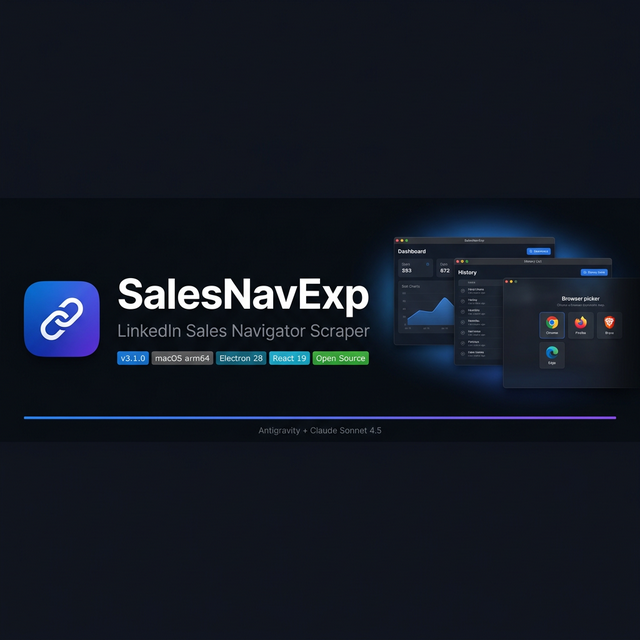

<div align="center">



</div>

<br/>

<div align="center">

> [!WARNING]
> **Experimental software** — not affiliated with LinkedIn Corporation, not notarized by Apple. Use at your own risk and discretion. Not recommended for misuse.

</div>

<br/>

## Why SalesNavExp?

Extracting leads from LinkedIn Sales Navigator manually is slow, error-prone, and doesn't scale. SalesNavExp automates the entire flow inside a native macOS desktop app — no browser extensions, no cloud middleman, no subscription. Just launch your browser, point it at a search, and let it run.

<br/>

<div align="center">

| | Feature | Details |
|---|---|---|
| 🌐 | **Multi-Browser Support** | Chrome, Firefox, Brave, Edge — auto-detected, one-click launch |
| ⚡ | **Real-time Scraping** | Live progress, leads/min speed, stop & save at any point |
| 📊 | **Analytics Dashboard** | 14-day lead trend, weekly bar chart, session stats |
| 📋 | **Smart History** | Sessions grouped by day, search, file-missing detection |
| ☁️ | **Google Drive Sync** | Upload CSV directly to Drive after each scrape |
| ⚙️ | **Fully Configurable** | Delays, max leads, CSV format, output folder, theme |
| 🧠 | **About Dialog** | Dynamic chip detection (Apple M4 Pro · 16 GB), version info |
| 🖥️ | **Native macOS Feel** | Vibrancy, traffic lights, dark/light mode, hidden titlebar |

</div>

<br/>

---

## 📸 Screenshots

<table>
<tr>
<td align="center" width="50%">
  
  <br/><sub><b>📊 Analytics Dashboard</b> — leads trend, weekly summary, quick actions</sub>
</td>
<td align="center" width="50%">
  
  <br/><sub><b>📋 History</b> — scrape sessions grouped by date, search, reveal in Finder</sub>
</td>
</tr>
<tr>
<td align="center" width="50%">
  
  <br/><sub><b>⚡ Scrape Flow</b> — browser picker, configure, live progress, complete</sub>
</td>
<td align="center" width="50%">
  
  <br/><sub><b>✅ Scrape Complete</b> — leads saved, open file or push to Google Drive</sub>
</td>
</tr>
</table>

---

## 🚀 Getting Started

### Requirements

| | Requirement |
|---|---|
| 🍎 | macOS 12 Monterey or later (Apple Silicon / arm64) |
| 🔗 | LinkedIn Sales Navigator active subscription |
| 🌐 | Chrome, Firefox, Brave, or Edge installed |
| 🟢 | Node.js v18+ *(only if building from source)* |

---

### Option A — Download the DMG *(Recommended)*

1. Head to [**Releases →**](https://github.com/srg-sphynx/SalesNavExp/releases)
2. Download `LinkedIn Scraper-3.1.0-arm64.dmg`
3. Open the DMG and drag the app to **Applications**

> **Seeing "App is damaged" or "unidentified developer"?** This is expected — the app is not notarized by Apple.

**Fix via Terminal:**
```bash
xattr -cr "/Applications/LinkedIn Scraper.app"
```
Or: right-click the app → **Open** → **Open** in the dialog.

---

### Option B — Build from Source

```bash
# Clone
git clone https://github.com/srg-sphynx/SalesNavExp.git
cd SalesNavExp

# Install dependencies
npm install
cd frontend && npm install && npm run build && cd ..

# Run
npm start

# Package DMG
npm run build:dmg
```

---

## 🕹️ How to Use

```
1. Open app → New Scrape
2. Select your browser (Chrome / Firefox / Brave / Edge)
3. Click Launch — browser opens to linkedin.com/sales
4. Log in and navigate to your Sales Navigator search or list
5. Back in the app: set list name + max leads → Start Scraping
6. Watch real-time progress — navigate away freely, it keeps running
7. On completion: Open File (CSV) or Upload to Google Drive
```

---

## 📄 Output Format

```csv
Name,LinkedIn Profile URL
Jane Smith,https://www.linkedin.com/in/janesmith
John Doe,https://www.linkedin.com/in/johndoe
```

Saved to `~/Downloads/LinkedIn Scraper/` with a timestamp in the filename by default.

---

## ☁️ Google Drive Setup *(Optional)*

1. Create a project in [Google Cloud Console](https://console.cloud.google.com/)
2. Enable the **Google Drive API**
3. Create **OAuth 2.0 Desktop** credentials → download `credentials.json`
4. Right-click the app → Show Package Contents → `Contents/` → paste `credentials.json`
5. App → **Settings → Integrations → Connect Google Drive**

---

## 🏗️ Architecture

```
SalesNavExp/
├── main.js              ← Electron main — IPC handlers, browser launch, file I/O
├── preload.js           ← Context bridge (renderer ↔ main)
├── lib/
│   ├── scraper.js       ← Playwright CDP scraping engine
│   └── googleDrive.js   ← Google Drive OAuth2 + upload
└── frontend/            ← React 19 + Vite 7 + Tailwind 3
    └── src/
        ├── pages/       ← Dashboard, ScrapePage, HistoryPage, FilesPage, SettingsPage
        ├── components/  ← Sidebar, AboutModal, shadcn/ui primitives
        └── contexts/    ← ScrapeContext (global scrape state)
```

| Layer | Tech |
|---|---|
| Shell | Electron 28 |
| Frontend | React 19 + Vite 7 |
| Styling | Tailwind CSS 3 + shadcn/ui |
| Charts | Recharts |
| Scraping | Playwright (CDP / remote debug) |
| Cloud | Google Drive API v3 |
| Packaging | electron-builder (APFS DMG) |

---

## 🔧 Troubleshooting

| Problem | Fix |
|---|---|
| `"Chrome debug port not available"` | Click **Launch Browser** first and wait for it to fully open |
| `"No leads found"` | Navigate to a Sales Navigator **search results** page first |
| Browser not in picker | Browser not installed at the standard `/Applications/` path |
| "File missing" badge in History | CSV was moved or deleted from disk — history record remains |
| Drive connection timeout | Re-check `credentials.json` placement, then retry |
| `"App is damaged"` | Run `xattr -cr "/Applications/LinkedIn Scraper.app"` in Terminal |

---

## ⚠️ Legal Disclaimer

This is an **independent experiment** for educational purposes.

- **Not affiliated with LinkedIn Corporation.** LinkedIn® is a registered trademark of LinkedIn Corporation.
- **Not notarized by Apple.** Not submitted to or approved by Apple.
- **May violate LinkedIn's ToS.** Scraping may breach [LinkedIn's User Agreement](https://www.linkedin.com/legal/user-agreement). Account suspension is a real risk.
- **No warranty.** Provided "as is". Author is not liable for any consequences.
- **Do not misuse.** Must not be used for spam, harassment, data resale, or any unlawful purpose.
- **Use reasonable delays.** Aggressive scraping risks IP blocks and CAPTCHA.

> By using this software you accept full responsibility for any consequences.

---

## 📜 License

Personal, non-commercial use only. All rights reserved. Redistribution requires permission.

---

<div align="center">

*SalesNavExp v3.1.0 — Powered by Antigravity + Claude Sonnet 4.5*

</div>
